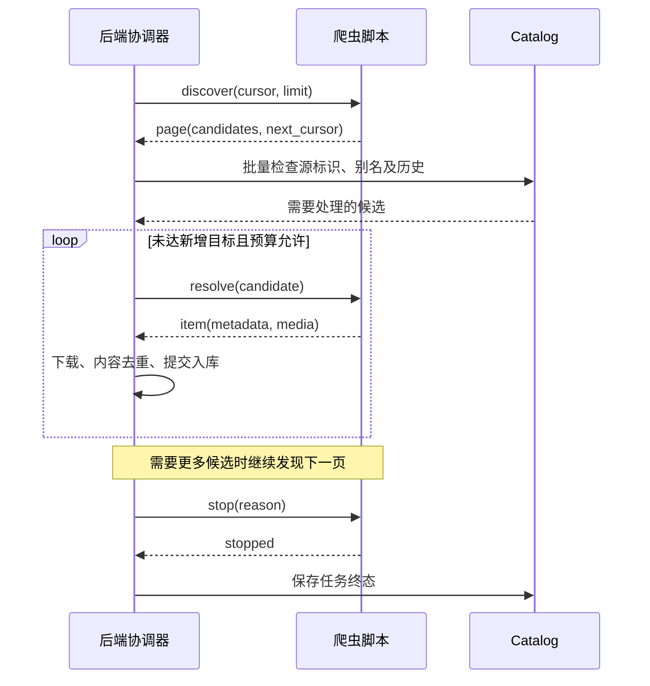

# 爬虫模块与 crawler.v3 协议设计方案

状态：待实施设计方案。

日期：2026-09-28。

本文描述项目爬虫模块和下一版脚本协议的优化方向。本文中的 `crawler.v3` 尚未实现，消息示例用于说明设计；当前协议仍以 [CRAWLER_PROTOCOL.md](CRAWLER_PROTOCOL.md) 为准。实施时需要同步更新后端、协议文档和文档中的参考脚本。

## 1. 目标与边界

后端统一控制任务执行，脚本负责源站的候选发现和内容解析。

本次设计的主要目标：

- 在访问详情页之前完成已知内容筛选，减少重复请求。
- 以实际入库结果控制新增目标，统一进度、错误和停止原因。
- 让已接受的任务具有可查询、可取消、可追踪的完整生命周期。
- 统一正式运行和试跑使用的进程管理、协议解析及校验逻辑。
- 明确每个模块的职责，减少当前抓取、下载、协议和任务编排之间的交叉依赖。

协议升级不兼容旧版本：后端最终只接受 `crawler.v3`，删除 v1/v2 的解析分支、默认回退和字段别名。用户根据新协议自行升级脚本，项目不自动改写用户脚本。

协议不兼容不意味着清空数据。已有视频、去重历史、删除记录和用户关联数据应继续保留。

## 2. 当前问题及依据

### 2.1 去重介入过晚

2026-09-28 09:29 开始的一次手动抓取，新增 3 条，用时约 12 分 45 秒。脚本请求了 195 个详情页，其中 192 次访问后才发现对应内容已经处理过；随后上传阶段约 13 秒完成。

当前已导入脚本在列表阶段主要按 `viewkey` 筛选，后端导出的历史主要是 `source_id`。即使列表中能够提取源 ID，源 ID 的历史检查也发生在详情解析之后。

现有协议要求脚本尽早跳过已知 ID，但单向输出完整候选的执行方式，使得去重策略、分页和详情请求仍主要由脚本自行组织。

### 2.2 统计口径不一致

当前后端的 `TotalEntries`、`Skipped` 主要统计送达后端的候选，不能反映脚本检查和跳过的全部内容。上述运行的后端总结为 `total=3, new=3, skipped=0`，无法直接解释 192 次已知内容访问。

管理页面的“本轮新增”还使用候选输出数量 `Emitted`，候选下载失败或被内容去重前就可能被计入新增。

### 2.3 任务结果和退出逻辑分散

抓取、资源生成和上传分布在不同入口中。上传已有结果持久化，抓取主要依靠日志和最后运行时间。定时抓取回调不返回结果或错误，整轮调度难以准确汇总抓取失败。

此前发现的“空闲状态早于结果保存”和“刚接受就取消时缺少结果”都与任务生命周期边界有关。新设计应从任务接受时就建立持久记录。

### 2.4 协议实现存在重复和兼容负担

正式执行的 `runtime.go` 和试跑的 `dryrun.go` 各自解析 stdout、判断事件并管理进程。当前数据结构同时接受顶层字段、嵌套字段和多种 headers 回退方式，增加了实现及排查成本。

相关代码：

- [抓取与导入实现](../internal/drives/scriptcrawler/crawler.go)
- [正式运行协议处理](../internal/drives/scriptcrawler/runtime.go)
- [脚本试跑](../internal/drives/scriptcrawler/dryrun.go)
- [应用层爬虫编排](../cmd/server/crawlers.go)
- [上传执行与结果收尾](../internal/crawlerupload/execution.go)

## 3. 模块设计

### 3.1 职责划分

| 模块 | 主要职责 | 依赖边界 |
| --- | --- | --- |
| 任务协调器 | 接受任务、配置快照、预算、取消、阶段推进、结果汇总 | 调用脚本会话、Catalog、导入和后续处理模块 |
| 脚本会话 | 启动进程、JSONL 收发、协议校验、操作超时、进程退出 | 不承担数据库写入、内容去重或上传决策 |
| 视频导入器 | 下载、媒体校验、指纹、内容去重、入库、文件清理 | 复用现有媒体和去重能力，不负责分页或读取脚本 stdout |
| 后续处理模块 | 封面、预览和上传 | 保留各自业务职责，由协调器安排和跟踪 |
| 本地存储驱动 | 文件定位、读取、列举及删除 | 保持存储驱动职责，不承担任务生命周期 |

将当前 `crawler.go` 中的协议类型、进程管理和导入流程按职责拆开。文件和包的划分应服务于这些边界，不必为每个步骤创建接口或引入通用工作流框架。

`cmd/server` 保留应用接线和任务触发；任务状态转换、结果归并和取消规则集中到协调器。

### 3.2 手动和定时使用同一执行入口

手动操作、定时调度和试跑共用脚本会话。手动与定时任务共用执行和结果收尾逻辑，入口只决定何时启动及执行哪些阶段。

协调器返回明确结果和错误，定时任务据此形成整轮结果。不得仅将错误写到日志后向上层报告正常结束。

任务运行期间使用一致的配置快照，包括脚本版本、源配置及上传目标。沿用现有网盘任务准入和配置变更协调机制，避免执行中切换目标或混用不同版本的配置。

### 3.3 任务生命周期

执行顺序：

1. 完成任务准入，生成任务 ID。
2. 保存 `queued` 记录，保存失败则不返回“已接受”。
3. 后台执行器领取任务，进入 `running`。
4. 在发现、解析、导入、资源生成及上传过程中更新阶段和进度。
5. 统一汇总结果，保存终态及停止原因。
6. 发布空闲状态并释放任务占用。

取消在排队期和运行期均有效。清理和结果保存使用有时限、独立于业务取消的上下文，确保取消后仍可记录结果。

服务重启后识别遗留的未完成任务并标记为中断。首版不承诺从任意中间步骤自动续跑；重新运行通过历史记录和入库幂等性避免重复处理。

抓取结果与上传结果分别保存，通过父任务 ID 关联。抓取任务可以完成本地入库，上传任务单独记录远端迁移是否成功。

### 3.4 视频导入和后续处理

视频导入器返回明确的单条结果：新增成功、已知内容跳过、内容重复或失败。只有入库提交成功才增加新增计数。

继续保留现有指纹、内容去重和上传远端核对能力。源标识去重用于减少重复访问；内容去重仍用于识别不同源标识对应的相同内容。

移除现有爬虫导入中“用更大的近重复视频替换旧视频”的行为。确认内容重复（包括近重复）后，统一保留库内已有视频并跳过新候选，不以文件大小作为替换依据。文件大小不能可靠代表画质，替换已上传视频还会造成库内记录已替换、远端旧文件仍保留的问题。

该规则同时适用于已有视频仍在本地和已上传网盘的情况。跳过新候选时，不迁移或改写已有视频的用户关联数据，不删除已有视频记录、原文件或衍生资源。新候选计入内容重复数，不增加新增数；记录其源历史和发现标识关联，指向已有视频，仅清理本次导入为该候选创建的文件和衍生资源，不为该候选继续生成资源或上传。后端继续寻找其他候选，直到达到新增目标或预算上限。

资源生成与上传根据已入库视频推进，并保留资源限流、目标网盘任务协调和每条视频的上传资格检查。首版先统一职责与结果，不同时扩大并发规模。

### 3.5 试跑复用

试跑复用正式运行的协议会话、消息校验、操作超时和退出机制。

试跑获取候选并完成解析后，执行媒体探测，不执行正式入库。测试结果明确显示已验证的范围，不将一次媒体探测视为完整抓取和上传都已验证。

协议文档中的参考模板和示例应由自动化测试运行，防止文档、试跑和正式执行出现不同约定。

## 4. crawler.v3 交互模型

### 4.1 启动和通道

继续使用单个 Python 文件，并在模块顶层显式声明：

```python
CRAWLER_NAME = "示例爬虫"
CRAWLER_PROTOCOL = "crawler.v3"
```

继续通过以下方式启动：

```bash
python3 crawler.py --job /absolute/path/to/job.json
```

通道职责：

- stdin：后端发送命令，使用 UTF-8 JSON Lines。
- stdout：脚本返回协议响应及约定的心跳事件，使用 UTF-8 JSON Lines。
- stderr：诊断日志及异常堆栈，不承担业务错误或结果判定。

每条 JSONL 消息必须完整、限长并立即 flush。每条命令具有 `request_id`，响应必须携带对应 ID。

每个脚本会话默认只允许一条未完成的业务命令。后端在处理当前候选期间不继续要求脚本解析其他候选，从执行方式上限制提前工作量。

启动配置保留协议版本、任务 ID、爬虫 ID、任务工作目录、站点配置和管理员代理配置。新增目标及全局扫描预算由后端协调器持有，脚本接收每次操作需要遵守的上限和截止时间。

### 4.2 命令和响应

| 后端命令 | 脚本响应 | 用途 |
| --- | --- | --- |
| `discover` | `page` | 获取一页轻量候选及下一页游标 |
| `resolve` | `item` | 解析指定候选并返回媒体信息 |
| `stop` | `stopped` | 在操作边界正常结束会话 |
| `discover` 或 `resolve` 失败 | `error` | 说明错误类型、影响范围和重试信息 |

一次发现只返回轻量候选，不要求脚本为其中所有候选访问详情页或下载媒体。列表直接提供完整媒体信息的站点可以在解析时复用缓存，无需额外发起网络请求。



### 4.3 发现候选

发现命令示例：

```json
{
  "type": "discover",
  "request_id": "request-1",
  "cursor": null,
  "limit": 24,
  "deadline_at": "2026-09-28T08:01:00Z"
}
```

响应示例：

```json
{
  "type": "page",
  "request_id": "request-1",
  "items": [
    {
      "discovery_key": "detail:abc",
      "source_id": "123456",
      "locator": {
        "detail_url": "https://example.com/video/abc"
      }
    }
  ],
  "next_cursor": "page:2"
}
```

`next_cursor` 是脚本理解的游标，后端原样传回；为 `null` 表示没有下一页。最后一页仍然可以包含候选。

`limit` 限制返回的候选数量。源站一页超过限制时，脚本应通过游标表达剩余位置，不能直接丢弃未返回的候选。

`locator` 是供脚本解析候选使用的有限大小 JSON 对象，后端不解释站点语义。后端不得依赖脚本的 Python 内存对象或对象地址来识别候选。

### 4.4 两种标识及历史管理

| 字段 | 含义 | 提供时机 |
| --- | --- | --- |
| `discovery_key` | 列表中即可获得的稳定发现标识，例如详情页 viewkey 或永久路径 | `page` 中必填 |
| `source_id` | 源站稳定内容 ID，用于识别同一条源内容 | 发现时尽量提供，`item` 中必填 |

两个标识均在爬虫作用域内解释。它们可以相同，但不能混在一个无类型集合里进行隐式判断。

后端保存 `discovery_key → source_id` 的关联，并结合源记录和删除记录判断是否已处理：

1. 发现阶段能提供 `source_id` 时，直接查源历史。
2. 只有 `discovery_key` 时，查已经建立的关联。
3. 两者都无法命中已处理内容时，才发出 `resolve`。
4. 解析得到已有源 ID 时，补充关联并跳过后续导入。
5. 新源成功入库或被确认重复后，记录源历史和关联。

失败或仅被发现的候选不得永久标记为已处理。删除记录继续参与筛选；恢复操作沿用明确的恢复流程。

标识必须稳定、非空并满足协议长度限制。后端不静默替换字符、截断或根据标题和临时 URL 生成替代 ID。内部文件名单独生成，不直接使用未经处理的协议标识作为路径。

源身份应有独立持久记录，避免依赖从视频 ID 或文件名反推。升级时保留现有源 ID；能够可靠提取的历史建立索引，不猜测缺失的发现标识关联。

全量 `seen_source_ids_file` 从新协议中移除。历史查询和长期去重状态由后端管理。

### 4.5 按需解析和单一媒体结构

解析命令示例：

```json
{
  "type": "resolve",
  "request_id": "request-2",
  "candidate": {
    "discovery_key": "detail:abc",
    "source_id": "123456",
    "locator": {
      "detail_url": "https://example.com/video/abc"
    }
  },
  "deadline_at": "2026-09-28T08:02:00Z"
}
```

媒体响应示例：

```json
{
  "type": "item",
  "request_id": "request-2",
  "discovery_key": "detail:abc",
  "source_id": "123456",
  "title": "示例视频",
  "detail_url": "https://example.com/video/abc",
  "media": {
    "type": "url",
    "url": "https://example.com/media/123456.mp4",
    "headers": {
      "Referer": "https://example.com/video/abc"
    }
  },
  "thumbnail": {
    "type": "url",
    "url": "https://example.com/thumb/123456.jpg",
    "headers": {}
  }
}
```

媒体结构仅保留一种表达方式：

- URL 媒体使用 `type=url`、`url` 和该媒体自己的 `headers`。
- 视频和封面均由后端下载，媒体对象仅支持 `type=url` 和 HTTP(S) 地址，不接受本地文件路径。
- 视频和封面各自声明请求头，删除共享 headers 与多层回退规则。
- 发现阶段已声明的源 ID 不允许在解析阶段无说明地变成另一条内容。
- 标题和源 ID 必填；其他元数据的允许字段、类型和限制由正式协议列明。

协议字段严格校验，未知字段明确报错；站点配置和 `locator` 等约定的扩展对象不按站点内部字段进行解析。

### 4.6 统计和预算的所有权

后端维护以下统计：

| 统计 | 计数依据 |
| --- | --- |
| 发现页数 | 成功接收并校验的 `page` 响应 |
| 候选检查数 | 收到并检查的候选条目；重复条目另行计数 |
| 已知跳过数 | 根据源历史或发现标识关联跳过的候选 |
| 解析成功数 | 完成协议校验的 `item` 响应 |
| 新增数 | 实际完成入库提交的新视频 |
| 内容重复数 | 导入阶段确认的内容重复 |
| 失败数 | 关联到具体阶段和对象的最终失败 |

重试次数与业务条目数分别记录。脚本不再上报“实际新增数”，页面也不再用候选数量代替新增数量。

删除 `target_new`、`unique_target`、`candidate_budget` 的别名关系。用户目标在后端统一表示为实际新增目标；整轮不限制发现页数、候选检查数或解析次数，也不因连续若干页没有新增而自动结束。这些数量只用于统计。运行预算保留爬取总时长与有限重试，单次发现、解析和下载另有操作超时。

爬取时限从任务开始执行时计时，默认 3 小时，覆盖发现、解析、下载、去重及重试等待，不会被翻页或心跳重置。达到新增目标、源站没有下一页、达到时限或用户停止时结束获取内容。达到时限属于预期停止，记录 `time_limit`，不增加失败条数，也不作为脚本故障上报；单次操作超时记录 `operation_timeout`。超时说明、目标、新增数量和耗时写入日志，不新增页面提示。

爬取截止时间不约束已完整下载视频的校验、去重、入库和后续资源生成、上传。未完成下载停止并清理临时文件；完整下载的结果在任务上下文中完成收尾。终态保存成功后才释放任务占用，后续上传较慢不会反过来改变抓取阶段的停止原因。

后端检测重复游标、重复页面、单次响应的候选数量越界及请求 ID 不匹配。对于排序会变化的热门列表，连续无新增页不能作为源站已耗尽的依据，后端根据下一页游标继续发现，直到达到新增目标或爬取时限。

协议调用次数由后端直接控制；脚本内部真实 HTTP 请求数需要脚本遵守约定并提供诊断信息，不能宣称仅凭 JSONL 就能强制限制所有内部网络请求。

### 4.7 错误与重试

错误响应示例：

```json
{
  "type": "error",
  "request_id": "request-2",
  "scope": "source",
  "code": "rate_limited",
  "message": "源站暂时限制访问",
  "retryable": true,
  "retry_after_seconds": 60
}
```

错误至少区分单条内容与整个源站两个影响范围，并定义稳定的错误码，例如 `not_found`、`parse_failed`、`auth_required`、`rate_limited` 和 `source_unavailable`。

后端根据错误类型、影响范围、重试预算及总截止时间决定继续、等待或停止。脚本不得叠加多层不可见重试；站点库内部的重试配置也应遵守协议约定。

`discover` 和 `resolve` 应支持有界重试。重试不能推进脚本内部的隐式分页位置、重复累计成功结果，或要求沿用无法重建的内存引用；分页输入和候选定位信息应足以重新执行对应操作。

stderr 使用明确等级的结构化诊断日志，原始异常堆栈可作为诊断文本保留。日志解析失败不改变业务结果，业务错误也不能只写 stderr 而不返回错误响应。

### 4.8 超时、心跳和停止

每次操作具有独立截止时间，整轮任务还有总时限。使用单调时间计算经过时长。

可定义携带当前请求 ID 的心跳事件，帮助定位长操作。心跳只表示进程存活，不得延长操作或整轮截止时间。后端处理下载、指纹和入库时，脚本等待下一条命令属于正常空闲，不触发源站无响应判断。

正常达到目标、源耗尽或预算耗尽时，后端在操作响应边界发送 `stop`，脚本确认后在宽限期内退出。

用户取消发生在脚本操作期间时，后端立即取消自己的后续工作，并通过进程终止机制要求脚本退出；不得假设同步脚本能在阻塞请求期间同时读取 stdin。优先发送终止信号，超过宽限期再结束整个进程树。

每个请求只允许一个最终响应。自然退出但缺少必需响应、请求 ID 不匹配或非法消息均视为协议错误。脚本退出确认只代表会话结束，整轮任务结果由后端决定。

## 5. 任务结果与页面展示

任务状态与停止原因分开保存。

状态描述任务生命周期，例如排队、运行、完成、部分完成、失败、取消和中断；停止原因描述为何结束，例如达到新增目标、源耗尽、扫描预算耗尽、超时、源站错误或协议错误。

“正常结束”不自动等于“达到新增目标”。结果同时保存目标数量、实际新增数量及是否达标。没有新内容时明确显示无新增；预算耗尽时显示实际完成数量与停止原因。

结果至少包含：

- 任务 ID、父任务 ID、爬虫 ID及脚本版本。
- 接受、开始、结束时间和各阶段耗时。
- 状态、停止原因、用户目标和实际统计。
- 有界的失败明细及完整失败总数。

任务列表和详情读取同一份结果数据。正在运行时展示本轮进度，历史结果明确标注为上一次运行。

每页或每阶段记录汇总日志，逐条请求细节放到调试级别。日志明确关联任务 ID、阶段及候选标识，避免依赖标题文本串联整轮过程。

## 6. 实施顺序

1. 建立任务及结果模型，统一准入、取消和终态保存；保证已接受即有记录。
2. 实现独立的 v3 脚本会话、严格消息模型和进程生命周期管理。
3. 将发现、历史筛选、按需解析和新增目标控制接入协调器，建立发现标识关联。
4. 从现有爬虫实现中分离视频导入职责，复用现有媒体校验、指纹和内容去重能力；移除按文件大小替换近重复视频的分支，统一保留已有视频并跳过重复候选，同步更新相关测试。
5. 让手动、定时和试跑使用相同执行组件，更新 API 与页面统计。
6. 同步重写正式协议文档，在文档中提供可复制的命令循环模板和两个站点函数示例。
7. 删除 v1/v2、seen 文件交换、旧字段别名和重复试跑解析器；旧脚本明确提示版本不支持，由用户自行升级。

后端和正式协议文档应作为同一版本发布，不能先将文档声明为已支持 v3，而运行代码仍只实现 v2。

## 7. 验收场景

- 列表返回已处理源 ID 时，后端不发起对应 `resolve`。
- 只知道发现标识的候选，在首次解析建立关联后，后续运行能提前跳过。
- 失败候选不会永久进入已处理历史；删除记录仍阻止自动重新导入。
- 列表或解析返回重复内容时，实际新增数保持准确，并继续寻找候选直到达标或达到预算。
- 新候选与已有视频近重复且文件更大时，仍跳过新候选；分别覆盖已有视频在本地和已上传网盘的情况，验证已有视频记录、用户关联数据及本地和远端文件均不因该候选而被替换或删除。
- 被跳过的近重复候选计入内容重复数，不增加新增数，不进入后续资源生成或上传；仅清理本次导入为该候选创建的文件和衍生资源，保存指向已有视频的源历史和发现标识关联，后续运行可提前跳过。
- 达到实际入库目标后停止解析剩余候选，导入失败不计入新增。
- 重复游标、重复页面和无效协议输出能有界结束并说明原因。
- 源站限流、单条内容缺失和登录失效采用不同的继续或停止策略。
- 刚接受即取消、运行中取消、保存结果期间取消和服务重启均留下可查询结果。
- 结果先保存，后发布空闲状态；脚本退出、取消和异常路径都释放任务占用。
- 试跑和正式运行对同一协议消息作出一致校验，媒体探测不产生正式入库副作用。
- 旧协议脚本被明确拒绝，已有视频与历史记录保留。
- 参考模板能够直接完成发现、解析、错误响应和正常退出的协议测试。

## 8. 预期收益与代价

主要收益是减少已知内容的详情访问，让新增目标、去重、预算和任务结果拥有明确的后端负责人。试跑与正式执行复用实现，也能降低协议演进成本。

脚本升级的主要代价是改为命令循环，并实现 `discover()` 和 `resolve()` 两个站点相关函数。项目通过协议文档中的参考模板降低接入成本，不要求用户理解后端数据库、内容指纹或上传调度。

该优化不承诺固定倍数的提速。实际收益取决于列表页能提供的稳定标识、历史关联覆盖率以及源站响应时间，应以详情请求数、已知跳过数、首条新增耗时和整轮耗时验证。
